# UI Component Library

<cite>
**Referenced Files in This Document**   
- [button.tsx](file://src/components/ui/button.tsx)
- [input.tsx](file://src/components/ui/input.tsx)
- [dialog.tsx](file://src/components/ui/dialog.tsx)
- [sheet.tsx](file://src/components/ui/sheet.tsx)
- [form.tsx](file://src/components/ui/form.tsx)
- [utils.ts](file://src/components/ui/utils.ts)
- [use-mobile.ts](file://src/components/ui/use-mobile.ts)
- [email-verification-screen.tsx](file://src/components/pwa/email-verification-screen.tsx)
- [order-confirmation-screen.tsx](file://src/components/pwa/order-confirmation-screen.tsx)
- [table-qr-screen.tsx](file://src/components/restaurant/table-qr-screen.tsx)
- [card.tsx](file://src/components/ui/card.tsx)
- [badge.tsx](file://src/components/ui/badge.tsx)
- [accordion.tsx](file://src/components/ui/accordion.tsx)
</cite>

## Table of Contents
1. [Introduction](#introduction)
2. [Core Components](#core-components)
3. [Accessibility and Keyboard Navigation](#accessibility-and-keyboard-navigation)
4. [Responsive Behavior and Mobile Detection](#responsive-behavior-and-mobile-detection)
5. [Form Integration and Validation](#form-integration-and-validation)
6. [Modal and Sheet Components](#modal-and-sheet-components)
7. [Theming and Customization](#theming-and-customization)
8. [Performance Considerations](#performance-considerations)
9. [Component Extension Guidelines](#component-extension-guidelines)
10. [Usage Patterns in PWA and Restaurant Interfaces](#usage-patterns-in-pwa-and-restaurant-interfaces)

## Introduction
The UI component library is built on Radix UI primitives and styled with Tailwind CSS, providing a consistent, accessible, and responsive design system for both PWA and restaurant interfaces. The components are designed to ensure accessibility, keyboard navigation, and screen reader support while maintaining visual consistency across different device sizes and user interactions.

**Section sources**
- [button.tsx](file://src/components/ui/button.tsx#L1-L59)
- [input.tsx](file://src/components/ui/input.tsx#L1-L22)

## Core Components

The component library includes foundational UI elements such as Button, Input, Card, Badge, and Accordion, each built with accessibility and usability in mind. These components leverage Radix UI's unstyled primitives combined with Tailwind CSS for styling, ensuring maximum flexibility and consistency.

### Button Component
The Button component supports multiple variants (default, destructive, outline, secondary, ghost, link) and sizes (default, sm, lg, icon). It uses `class-variance-authority` for variant management and includes focus states, disabled states, and accessibility attributes.

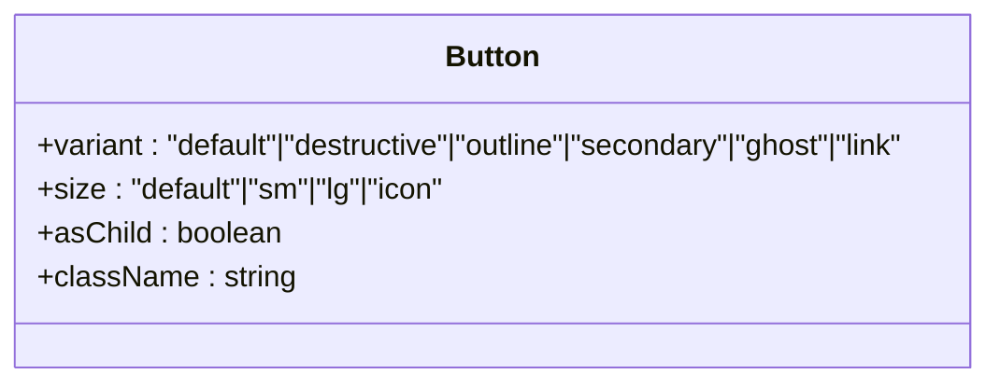

**Diagram sources**
- [button.tsx](file://src/components/ui/button.tsx#L1-L59)

### Input Component
The Input component provides styled text inputs with focus states, error states, and disabled states. It includes built-in accessibility features such as proper labeling and ARIA attributes for screen readers.

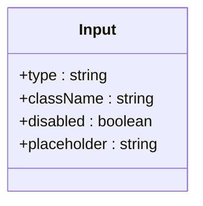

**Diagram sources**
- [input.tsx](file://src/components/ui/input.tsx#L1-L22)

### Card Component
The Card component serves as a container for related content, with structured sections for header, title, description, content, footer, and action elements. It provides a consistent layout pattern across the application.

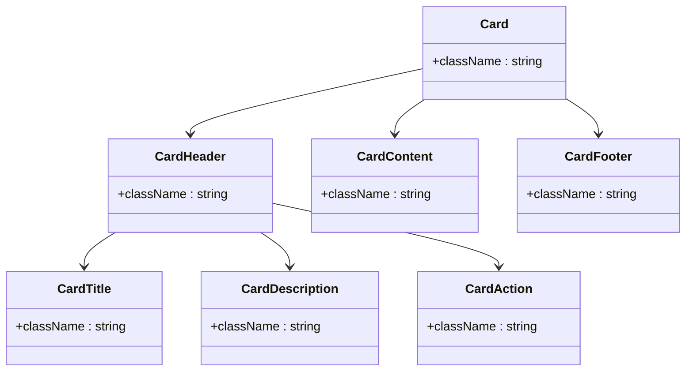

**Diagram sources**
- [card.tsx](file://src/components/ui/card.tsx#L1-L93)

### Badge Component
The Badge component displays small status indicators or labels with different variants (default, secondary, destructive, outline) for various use cases such as status tags or category labels.

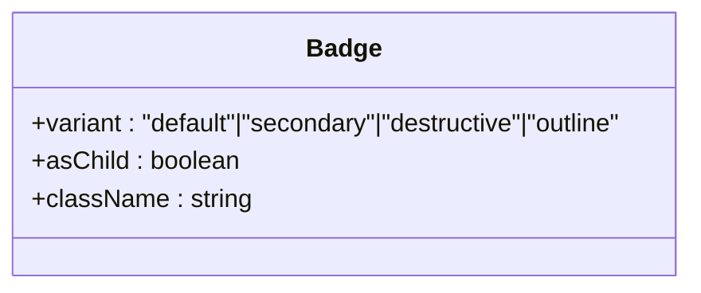

**Diagram sources**
- [badge.tsx](file://src/components/ui/badge.tsx#L1-L47)

**Section sources**
- [button.tsx](file://src/components/ui/button.tsx#L1-L59)
- [input.tsx](file://src/components/ui/input.tsx#L1-L22)
- [card.tsx](file://src/components/ui/card.tsx#L1-L93)
- [badge.tsx](file://src/components/ui/badge.tsx#L1-L47)

## Accessibility and Keyboard Navigation

All components in the library are built with accessibility as a core principle, leveraging Radix UI's accessible primitives. Components include proper ARIA attributes, keyboard navigation support, and screen reader optimizations.

### Focus Management
Components implement visible focus indicators through Tailwind classes like `focus-visible:border-ring` and `focus-visible:ring-ring/50`. The focus ring is applied only when users navigate with keyboards, maintaining a clean appearance for mouse users.

### Screen Reader Support
Interactive elements include appropriate ARIA roles and states. For example, the Dialog and Sheet components include `sr-only` text for screen readers, such as the "Close" label on close buttons.

### Keyboard Navigation
Radix UI primitives ensure proper keyboard navigation patterns:
- Tab navigation through interactive elements
- Escape key to close dialogs and sheets
- Arrow key navigation within composite components like Accordion

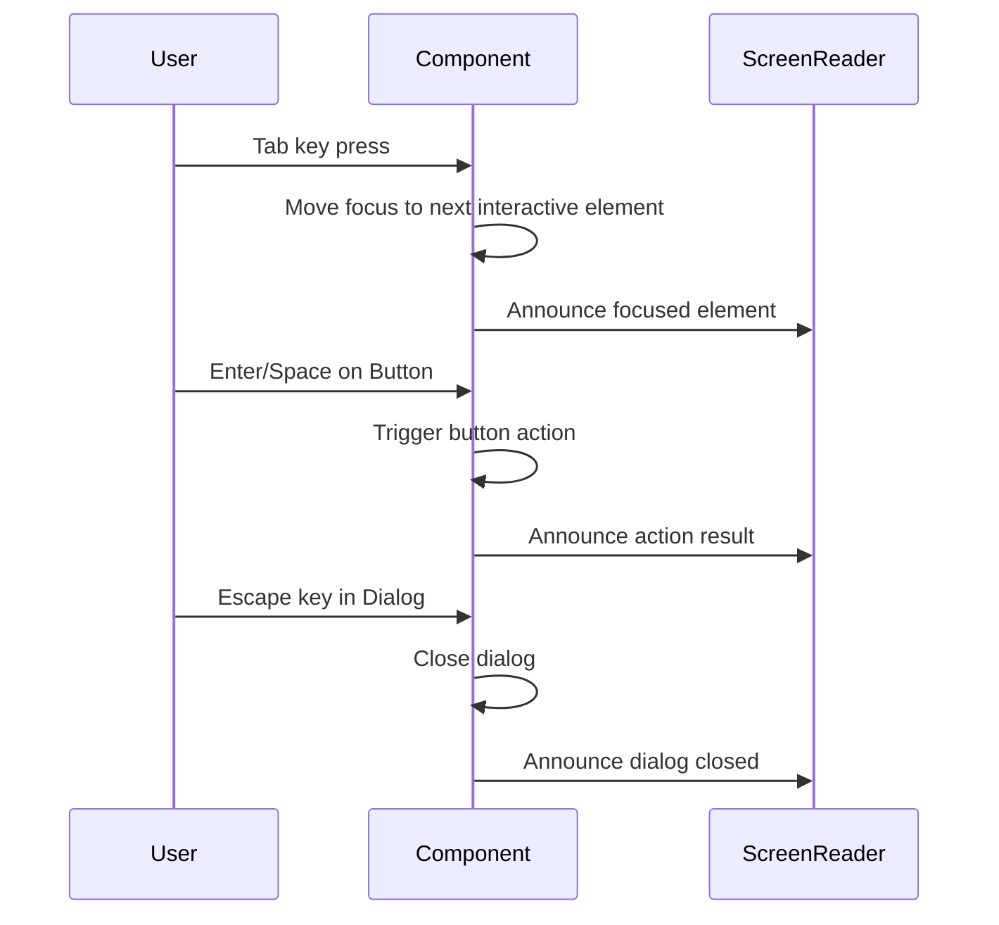

**Diagram sources**
- [dialog.tsx](file://src/components/ui/dialog.tsx#L1-L136)
- [sheet.tsx](file://src/components/ui/sheet.tsx#L1-L140)
- [accordion.tsx](file://src/components/ui/accordion.tsx#L1-L67)

**Section sources**
- [dialog.tsx](file://src/components/ui/dialog.tsx#L1-L136)
- [sheet.tsx](file://src/components/ui/sheet.tsx#L1-L140)
- [accordion.tsx](file://src/components/ui/accordion.tsx#L1-L67)

## Responsive Behavior and Mobile Detection

The component library includes utilities for responsive behavior and mobile device detection to ensure optimal user experience across different screen sizes.

### useIsMobile Hook
The `use-mobile.ts` utility provides a React hook that detects mobile devices based on screen width, using a breakpoint of 768px.

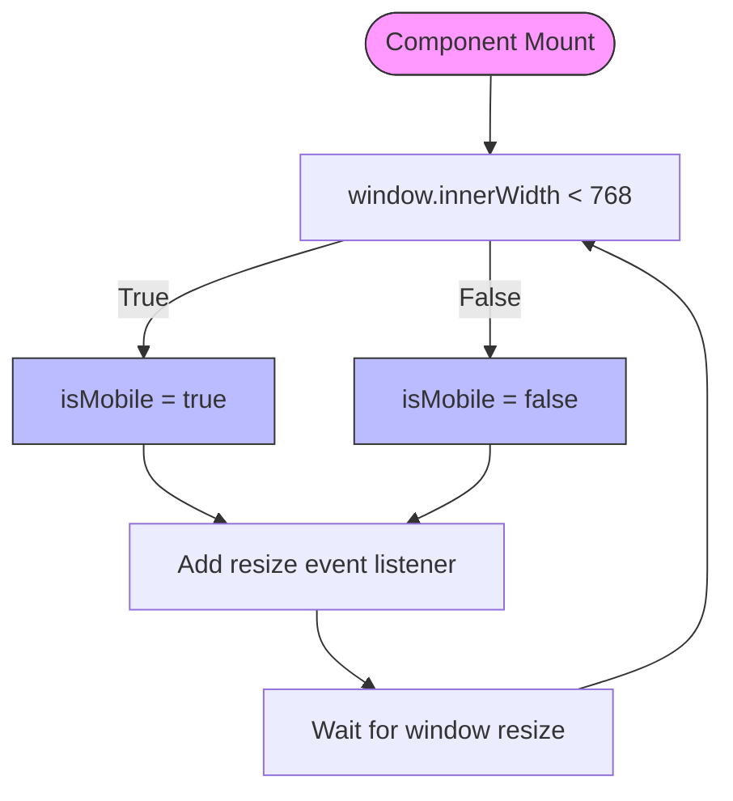

**Diagram sources**
- [use-mobile.ts](file://src/components/ui/use-mobile.ts#L1-L22)

### Responsive Design Patterns
Components use Tailwind's responsive prefixes (sm:, md:, lg:) to adapt layouts:
- Mobile-first design approach
- Stack content vertically on small screens
- Use larger tap targets on touch devices
- Adjust spacing and typography for readability

**Section sources**
- [use-mobile.ts](file://src/components/ui/use-mobile.ts#L1-L22)

## Form Integration and Validation

The form system is built on react-hook-form with custom UI components that provide seamless integration between form state and visual feedback.

### Form Component Structure
The form components follow a structured pattern with Form, FormItem, FormLabel, FormControl, FormDescription, and FormMessage components that work together to create accessible forms.

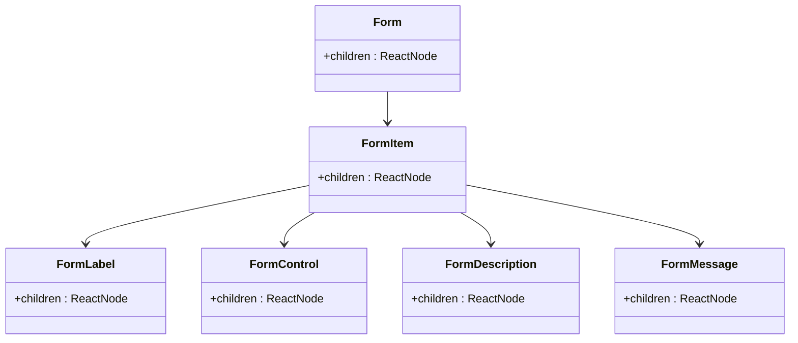

**Diagram sources**
- [form.tsx](file://src/components/ui/form.tsx#L1-L169)

### Email Verification Example
The email verification screen demonstrates form integration with validation, loading states, and error handling.

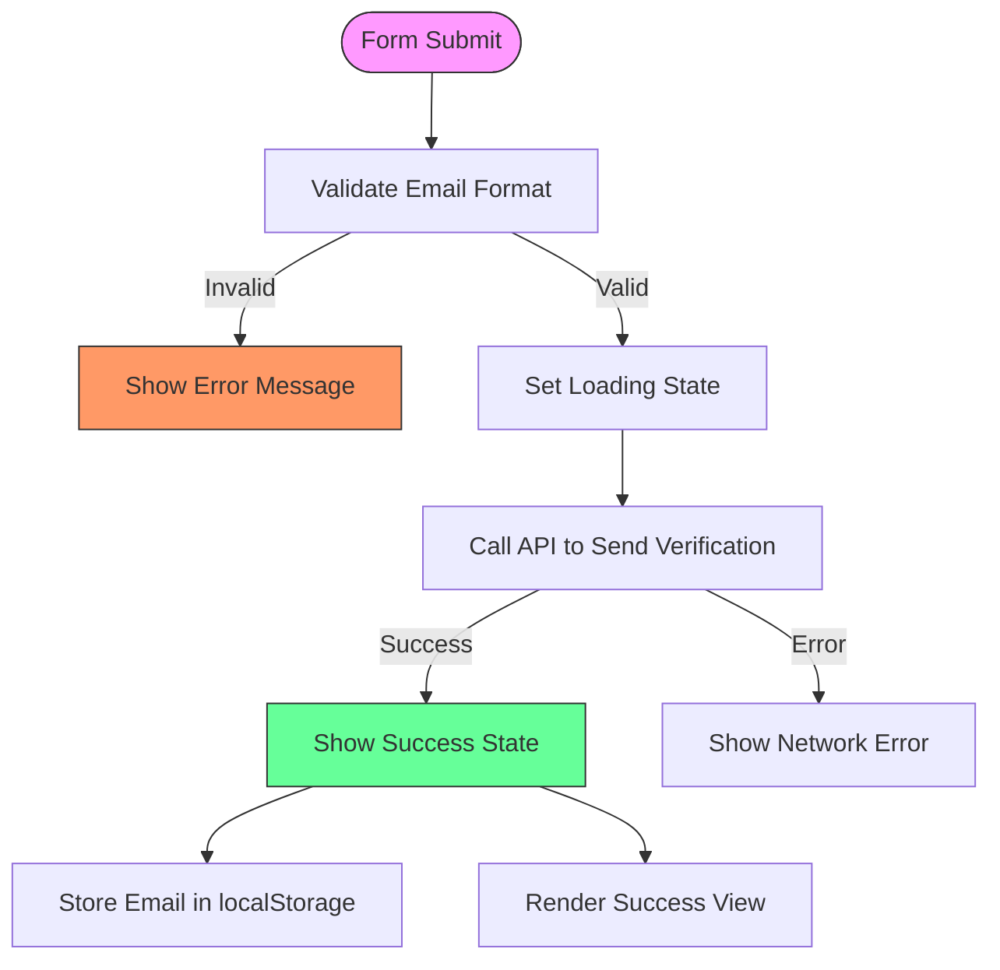

**Diagram sources**
- [email-verification-screen.tsx](file://src/components/pwa/email-verification-screen.tsx#L1-L194)
- [form.tsx](file://src/components/ui/form.tsx#L1-L169)

**Section sources**
- [form.tsx](file://src/components/ui/form.tsx#L1-L169)
- [email-verification-screen.tsx](file://src/components/pwa/email-verification-screen.tsx#L1-L194)

## Modal and Sheet Components

The library provides two types of overlay components: Dialog (modal) and Sheet (sliding panel), each with accessibility features and animation support.

### Dialog Component
The Dialog component creates a modal overlay with a backdrop, content area, and close functionality. It uses Radix UI's Dialog primitive with custom styling.

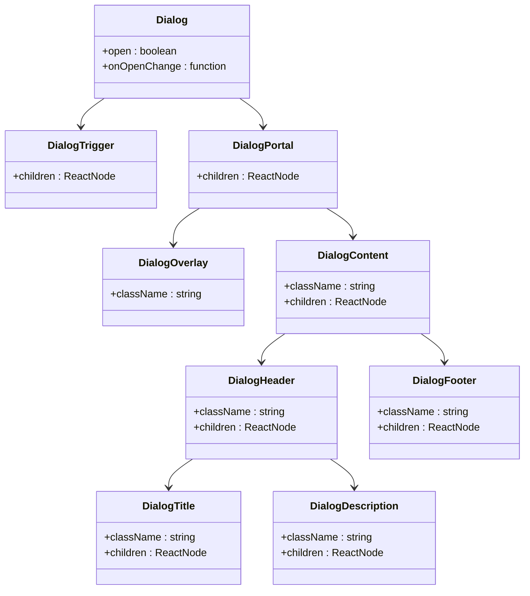

**Diagram sources**
- [dialog.tsx](file://src/components/ui/dialog.tsx#L1-L136)

### Sheet Component
The Sheet component provides a sliding panel that can appear from any edge of the screen (top, right, bottom, left), making it ideal for mobile interfaces.

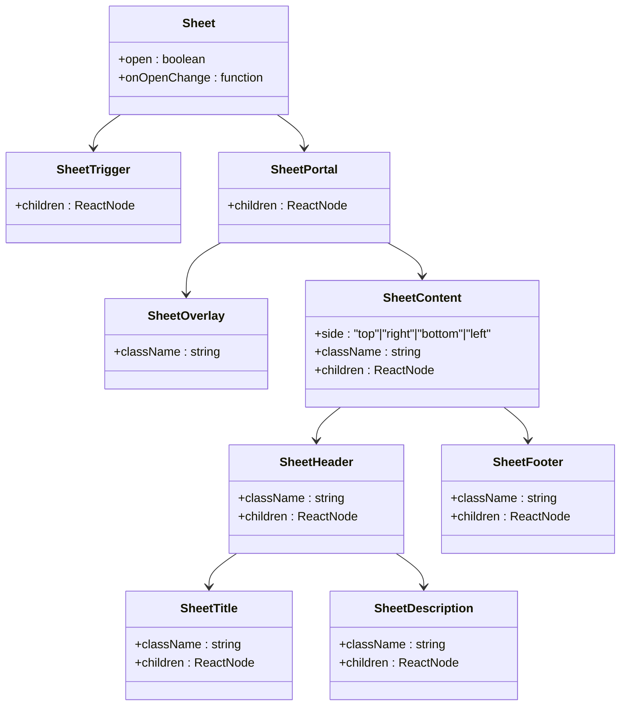

**Diagram sources**
- [sheet.tsx](file://src/components/ui/sheet.tsx#L1-L140)

**Section sources**
- [dialog.tsx](file://src/components/ui/dialog.tsx#L1-L136)
- [sheet.tsx](file://src/components/ui/sheet.tsx#L1-L140)

## Theming and Customization

The component library supports theming and customization through Tailwind CSS classes and variant system.

### Theme Variables
The styling system uses CSS variables defined in the global stylesheet, allowing for easy theme customization:
- Color palette (primary, secondary, destructive, etc.)
- Typography scales
- Spacing system
- Border radii
- Shadow levels

### Customization Options
Components can be customized through:
- Standard Tailwind utility classes
- Component-specific variants
- className prop for additional styling
- asChild prop to preserve child component styles

### Utility Functions
The `utils.ts` file provides a `cn()` function that combines `clsx` and `tailwind-merge` to properly merge Tailwind classes without conflicts.

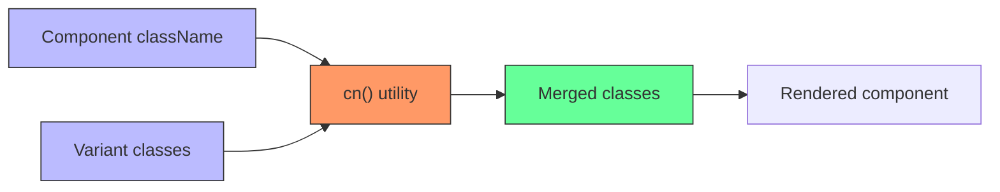

**Diagram sources**
- [utils.ts](file://src/components/ui/utils.ts#L1-L7)
- [button.tsx](file://src/components/ui/button.tsx#L1-L59)

**Section sources**
- [utils.ts](file://src/components/ui/utils.ts#L1-L7)
- [button.tsx](file://src/components/ui/button.tsx#L1-L59)

## Performance Considerations

The component library is designed with performance in mind, especially for rendering large lists such as menu items.

### Efficient Rendering
- Components use React.memo where appropriate
- Event handlers are properly memoized
- Heavy computations are avoided in render methods
- Virtualization can be implemented for large lists

### Bundle Size Optimization
- Tree-shakable exports via index.ts
- Only import needed components
- Code splitting for large components
- Lazy loading of non-critical components

### Memory Management
- Proper cleanup of event listeners
- Avoid memory leaks in useEffect hooks
- Efficient state management

**Section sources**
- [index.ts](file://src/components/ui/index.ts#L1-L6)

## Component Extension Guidelines

When extending components, maintain design system integrity by following these guidelines:

### Extension Patterns
- Use the asChild prop to wrap existing components
- Extend variants through the cva configuration
- Compose new components from existing primitives
- Maintain consistent spacing and typography

### Do's and Don'ts
- DO: Use existing color palette and spacing system
- DO: Maintain accessibility features
- DO: Follow naming conventions
- DON'T: Override base styles that affect global consistency
- DON'T: Remove accessibility attributes
- DON'T: Create redundant variants

**Section sources**
- [button.tsx](file://src/components/ui/button.tsx#L1-L59)
- [utils.ts](file://src/components/ui/utils.ts#L1-L7)

## Usage Patterns in PWA and Restaurant Interfaces

The components are used consistently across both PWA and restaurant interfaces, with specific patterns for different contexts.

### PWA Interface Patterns
The PWA interfaces use components to create user-friendly ordering experiences:

#### Email Verification Flow
The email verification screen uses Card, Input, and Button components to collect user email with validation.

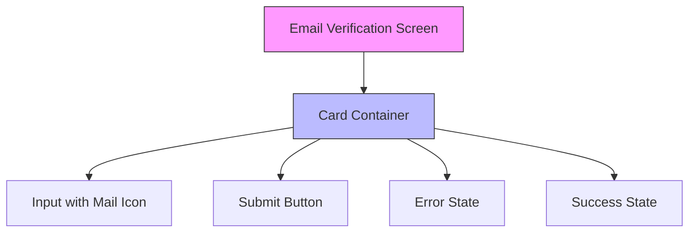

**Diagram sources**
- [email-verification-screen.tsx](file://src/components/pwa/email-verification-screen.tsx#L1-L194)

#### Order Confirmation Flow
The order confirmation screen uses Badge, Card, and Button components to display order status and next steps.

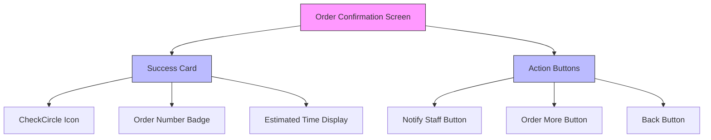

**Diagram sources**
- [order-confirmation-screen.tsx](file://src/components/pwa/order-confirmation-screen.tsx#L1-L154)

### Restaurant Interface Patterns
The restaurant interfaces use components for management tasks:

#### Table QR Code Management
The table QR screen uses Input, Button, Badge, and Card components to generate and manage QR codes for tables.

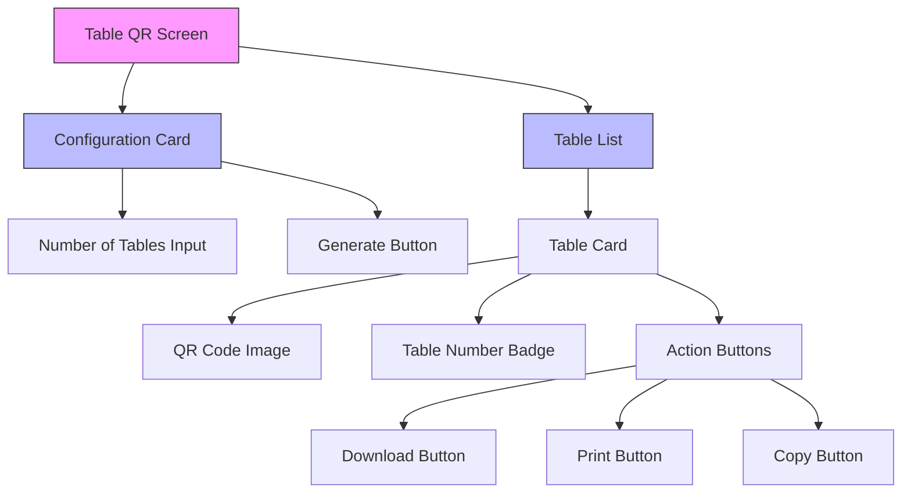

**Diagram sources**
- [table-qr-screen.tsx](file://src/components/restaurant/table-qr-screen.tsx#L1-L515)

**Section sources**
- [email-verification-screen.tsx](file://src/components/pwa/email-verification-screen.tsx#L1-L194)
- [order-confirmation-screen.tsx](file://src/components/pwa/order-confirmation-screen.tsx#L1-L154)
- [table-qr-screen.tsx](file://src/components/restaurant/table-qr-screen.tsx#L1-L515)