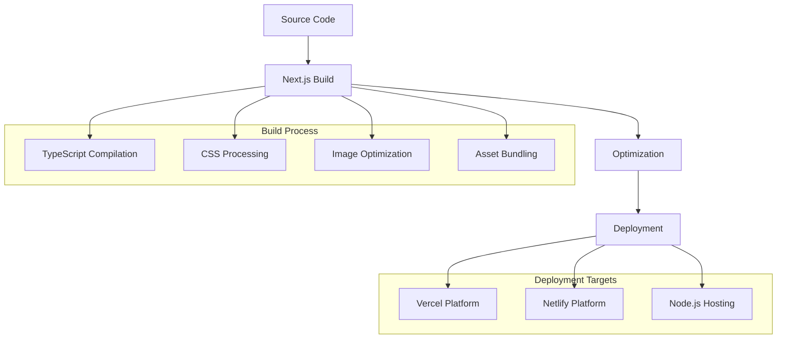

# Technology Stack

<cite>
**Referenced Files in This Document**
- [package.json](file://package.json)
- [next.config.js](file://next.config.js)
- [tsconfig.json](file://tsconfig.json)
- [tailwind.config.ts](file://tailwind.config.ts)
- [postcss.config.js](file://postcss.config.js)
- [jest.config.js](file://jest.config.js)
- [src/app/layout.tsx](file://src/app/layout.tsx)
- [src/components/ui/index.ts](file://src/components/ui/index.ts)
- [src/components/ui/button.tsx](file://src/components/ui/button.tsx)
- [src/components/ui/dialog.tsx](file://src/components/ui/dialog.tsx)
- [src/components/ui/utils.ts](file://src/components/ui/utils.ts)
- [src/app/api/auth/send-verification/route.ts](file://src/app/api/auth/send-verification/route.ts)
- [src/app/api/restaurant/generate-qr/route.ts](file://src/app/api/restaurant/generate-qr/route.ts)
- [src/app/api/restaurant/parse-menu/route.ts](file://src/app/api/restaurant/parse-menu/route.ts)
- [README.md](file://README.md)
</cite>

## Table of Contents
1. [Introduction](#introduction)
2. [Frontend Framework: Next.js 14 with App Router](#frontend-framework-nextjs-14-with-app-router)
3. [Programming Language: TypeScript](#programming-language-typescript)
4. [Styling System: Tailwind CSS](#styling-system-tailwind-css)
5. [UI Component Library: Radix UI](#ui-component-library-radix-ui)
6. [Icon System: Lucide React](#icon-system-lucide-react)
7. [Backend Dependencies](#backend-dependencies)
8. [Development Tools](#development-tools)
9. [Testing Framework](#testing-framework)
10. [Build and Deployment](#build-and-deployment)
11. [Version Compatibility](#version-compatibility)
12. [Performance Implications](#performance-implications)
13. [Integration Patterns](#integration-patterns)
14. [Best Practices](#best-practices)

## Introduction

MenuPRO-App-main is a modern restaurant management and digital menu system built with cutting-edge web technologies. The application leverages Next.js 14's App Router architecture for server-side rendering and API routes, React for component-based UI development, TypeScript for type safety, and Tailwind CSS for utility-first styling. The tech stack emphasizes developer productivity, performance, and accessibility while providing a seamless user experience across all devices.

## Frontend Framework: Next.js 14 with App Router

### Core Framework Architecture

Next.js 14 serves as the foundation for MenuPRO's modern web application, utilizing the latest App Router architecture for enhanced performance and developer experience. The framework provides:

- **Server-Side Rendering (SSR)**: Automatic optimization for SEO and faster initial page loads
- **Static Site Generation (SSG)**: Pre-rendering pages at build time for optimal performance
- **API Routes**: Built-in support for RESTful endpoints within the same codebase
- **File-Based Routing**: Intuitive routing based on the filesystem structure

### App Router Implementation

The application follows Next.js 14's App Router conventions with a clean separation of concerns:


**Diagram sources**
- [src/app/layout.tsx](file://src/app/layout.tsx#L1-L70)
- [src/app/page.tsx](file://src/app/page.tsx)

### Configuration Details

The Next.js configuration (`next.config.js`) is optimized for performance and development workflow:

```javascript
const nextConfig = {
  images: {
    domains: [], // No external image domains
    unoptimized: true, // For static exports if needed
  },
  typescript: {
    ignoreBuildErrors: false, // Strict type checking
  },
  eslint: {
    ignoreDuringBuilds: false, // Consistent linting
  },
}
```

**Section sources**
- [next.config.js](file://next.config.js#L1-L16)
- [src/app/layout.tsx](file://src/app/layout.tsx#L1-L70)

## Programming Language: TypeScript

### Type Safety Implementation

TypeScript provides comprehensive type safety throughout the MenuPRO application, ensuring robust code quality and developer productivity. The configuration supports:

- **Strict Type Checking**: Enhanced type safety with strict compiler options
- **Incremental Compilation**: Faster build times during development
- **Next.js Integration**: Seamless integration with Next.js App Router
- **Custom Path Mapping**: Simplified module imports with alias support

### Compiler Configuration

The TypeScript configuration (`tsconfig.json`) is designed for optimal development experience:

```json
{
  "compilerOptions": {
    "target": "es5",
    "lib": ["dom", "dom.iterable", "es6"],
    "strict": false, // Flexible development mode
    "noEmit": true, // Output handled by Next.js
    "baseUrl": "./src",
    "paths": {
      "@/*": ["./*"],
      "@components/*": ["components/*"],
      "@ui/*": ["components/ui/*"]
    }
  }
}
```

### Benefits of TypeScript Integration

- **IDE Support**: Enhanced autocompletion and refactoring capabilities
- **Runtime Safety**: Compile-time error detection prevents runtime issues
- **Documentation**: Types serve as living documentation for the codebase
- **Team Collaboration**: Consistent typing improves code maintainability

**Section sources**
- [tsconfig.json](file://tsconfig.json#L1-L43)

## Styling System: Tailwind CSS

### Utility-First Approach

Tailwind CSS provides a utility-first styling system that enables rapid development and consistent design implementation. The configuration extends the default theme with custom color palettes and responsive breakpoints.

### Design Token Integration

The Tailwind configuration integrates CSS custom properties for dynamic theming:

```typescript
theme: {
  extend: {
    colors: {
      background: 'var(--background)',
      foreground: 'var(--foreground)',
      primary: {
        DEFAULT: 'var(--primary)',
        foreground: 'var(--primary-foreground)',
      },
      // ... additional color definitions
    },
    borderRadius: {
      lg: 'var(--radius)',
      md: 'calc(var(--radius) - 2px)',
      sm: 'calc(var(--radius) - 4px)',
    },
  },
}
```

### Content Configuration

The Tailwind content configuration ensures optimal tree-shaking and build performance:

```typescript
content: [
  './src/pages/**/*.{js,ts,jsx,tsx,mdx}',
  './src/components/**/*.{js,ts,jsx,tsx,mdx}',
  './src/app/**/*.{js,ts,jsx,tsx,mdx}',
]
```

### CSS Architecture

The application uses a modular CSS architecture with global styles and component-specific styling:


**Diagram sources**
- [src/components/ui/utils.ts](file://src/components/ui/utils.ts#L1-L7)
- [tailwind.config.ts](file://tailwind.config.ts#L1-L68)

**Section sources**
- [tailwind.config.ts](file://tailwind.config.ts#L1-L68)
- [src/components/ui/utils.ts](file://src/components/ui/utils.ts#L1-L7)

## UI Component Library: Radix UI

### Accessible Component Foundation

Radix UI provides a collection of low-level, accessible components that form the foundation of MenuPRO's user interface. The library emphasizes:

- **Accessibility First**: Built-in ARIA attributes and keyboard navigation
- **Unstyled Components**: Minimal CSS baseline for maximum flexibility
- **Composition-Friendly**: Easy to customize and extend
- **TypeScript Support**: Full type safety for component props

### Component Variants and Integration

The application implements a sophisticated component variant system using `class-variance-authority`:

```typescript
const buttonVariants = cva(
  "inline-flex items-center justify-center gap-2 whitespace-nowrap rounded-md text-sm font-medium transition-all disabled:pointer-events-none disabled:opacity-50",
  {
    variants: {
      variant: {
        default: "bg-primary text-primary-foreground hover:bg-primary/90",
        destructive: "bg-destructive text-white hover:bg-destructive/90",
        outline: "border bg-background text-foreground hover:bg-accent",
        // ... additional variants
      },
      size: {
        default: "h-9 px-4 py-2",
        sm: "h-8 rounded-md px-3",
        lg: "h-10 rounded-md px-6",
        icon: "size-9 rounded-md",
      },
    },
    defaultVariants: {
      variant: "default",
      size: "default",
    },
  },
);
```

### Component Architecture

The UI component system follows a modular architecture with clear separation of concerns:


**Diagram sources**
- [src/components/ui/button.tsx](file://src/components/ui/button.tsx#L1-L59)
- [src/components/ui/dialog.tsx](file://src/components/ui/dialog.tsx#L1-L136)
- [src/components/ui/utils.ts](file://src/components/ui/utils.ts#L1-L7)

### Component Integration Patterns

The application demonstrates advanced integration patterns with Radix UI:

- **Slot Pattern**: Using `@radix-ui/react-slot` for flexible component composition
- **Variant System**: Consistent styling across components using `class-variance-authority`
- **Accessibility**: Proper ARIA labeling and keyboard navigation support
- **Animation**: Smooth transitions using Radix UI's animation primitives

**Section sources**
- [src/components/ui/button.tsx](file://src/components/ui/button.tsx#L1-L59)
- [src/components/ui/dialog.tsx](file://src/components/ui/dialog.tsx#L1-L136)
- [src/components/ui/utils.ts](file://src/components/ui/utils.ts#L1-L7)

## Icon System: Lucide React

### Modern Icon Library

Lucide React provides a modern, consistent icon system with over 1,000 icons designed for web applications. The library offers:

- **SVG Icons**: Lightweight, scalable vector graphics
- **Consistent Style**: Uniform design language across all icons
- **React Integration**: Native React component support
- **Tree Shaking**: Only included icons are bundled in production builds

### Icon Usage Patterns

Icons are integrated seamlessly throughout the application using the Lucide React components:

```typescript
import { XIcon } from "lucide-react";

function DialogClose() {
  return (
    <DialogPrimitive.Close className="absolute top-4 right-4">
      <XIcon />
      <span className="sr-only">Close</span>
    </DialogPrimitive.Close>
  );
}
```

**Section sources**
- [src/components/ui/dialog.tsx](file://src/components/ui/dialog.tsx#L1-L136)

## Backend Dependencies

### Authentication and Security

The application implements a comprehensive authentication system using JWT tokens and email verification:


**Diagram sources**
- [src/app/api/auth/send-verification/route.ts](file://src/app/api/auth/send-verification/route.ts#L1-L98)
- [src/app/api/auth/verify-otp/route.ts](file://src/app/api/auth/verify-otp/route.ts)

### Document Processing and OCR

The application includes advanced document processing capabilities for menu parsing:

- **PDF Parsing**: `pdf-parse` library for extracting text from PDF documents
- **OCR Processing**: `tesseract.js` for optical character recognition from images
- **Menu Item Extraction**: Intelligent parsing of menu items with price detection
- **Confidence Scoring**: Automated quality assessment of parsed data

### QR Code Generation

QR code functionality is implemented using the `qrcode` library:

```typescript
const qrCodeDataURL = await QRCode.toDataURL(orderUrl, {
  width: 200,
  margin: 2,
  color: {
    dark: '#000000',
    light: '#FFFFFF'
  }
});
```

### Backend Architecture

The backend architecture leverages Next.js API routes for serverless functions:


**Diagram sources**
- [src/app/api/auth/send-verification/route.ts](file://src/app/api/auth/send-verification/route.ts#L1-L98)
- [src/app/api/restaurant/parse-menu/route.ts](file://src/app/api/restaurant/parse-menu/route.ts#L1-L152)
- [src/app/api/restaurant/generate-qr/route.ts](file://src/app/api/restaurant/generate-qr/route.ts#L1-L98)

**Section sources**
- [src/app/api/auth/send-verification/route.ts](file://src/app/api/auth/send-verification/route.ts#L1-L98)
- [src/app/api/restaurant/parse-menu/route.ts](file://src/app/api/restaurant/parse-menu/route.ts#L1-L152)
- [src/app/api/restaurant/generate-qr/route.ts](file://src/app/api/restaurant/generate-qr/route.ts#L1-L98)

## Development Tools

### Build Toolchain

The application uses a modern build toolchain optimized for performance and developer experience:

- **PostCSS**: CSS processing with Tailwind CSS and autoprefixer
- **Autoprefixer**: Automatic vendor prefix generation
- **ESLint**: Code quality and consistency enforcement
- **TypeScript**: Static type checking and IDE support

### Development Workflow

The development configuration supports:

```javascript
module.exports = {
  plugins: {
    tailwindcss: {},
    autoprefixer: {},
  },
}
```

**Section sources**
- [postcss.config.js](file://postcss.config.js#L1-L7)

## Testing Framework

### Jest Configuration

The application implements comprehensive testing using Jest with Next.js integration:

```javascript
const customJestConfig = {
  setupFilesAfterEnv: ['<rootDir>/jest.setup.js'],
  testEnvironment: 'jsdom',
  moduleNameMapping: {
    '^@/(.*)$': '<rootDir>/src/$1',
    '^@ui/(.*)$': '<rootDir>/src/components/ui/$1',
    '^@components/(.*)$': '<rootDir>/src/components/$1',
  },
  collectCoverageFrom: [
    'src/**/*.{js,jsx,ts,tsx}',
    '!src/**/*.d.ts',
    '!src/**/*.stories.{js,jsx,ts,tsx}',
  ],
}
```

### Testing Architecture

The testing framework supports:

- **Component Testing**: React Testing Library for UI components
- **Integration Testing**: Comprehensive flow testing
- **Unit Testing**: Isolated function testing
- **Coverage Reporting**: Detailed code coverage analysis

**Section sources**
- [jest.config.js](file://jest.config.js#L1-L27)

## Build and Deployment

### Production Optimization

The application is configured for optimal production deployment:

- **Static Export**: Support for static site generation
- **Image Optimization**: Built-in Next.js image optimization
- **Code Splitting**: Automatic chunk splitting for optimal loading
- **Tree Shaking**: Elimination of unused code and dependencies

### Deployment Strategy

The application is designed for cloud-native deployment:



## Version Compatibility

### Framework Versions

The application uses specific version constraints for optimal compatibility:

- **Next.js**: ^14.0.0 (latest stable release)
- **React**: ^18.3.1 (latest stable release)
- **TypeScript**: ^5.0.0 (latest stable release)
- **Tailwind CSS**: ^3.4.0 (latest stable release)

### Dependency Matrix


**Section sources**
- [package.json](file://package.json#L1-L89)

## Performance Implications

### Bundle Size Optimization

The application implements several strategies for optimal bundle size:

- **Tree Shaking**: Elimination of unused code
- **Lazy Loading**: Dynamic imports for non-critical components
- **Image Optimization**: Automatic compression and format selection
- **CSS Purging**: Removal of unused CSS classes

### Runtime Performance

Performance optimizations include:

- **Server-Side Rendering**: Faster initial page loads
- **Static Generation**: Pre-rendered pages for optimal caching
- **Client-Side Hydration**: Efficient rehydration of interactive components
- **Progressive Enhancement**: Graceful degradation for JavaScript-disabled clients

### Memory Management

The application optimizes memory usage through:

- **Component Lifecycle Management**: Proper cleanup of event listeners and timers
- **State Management**: Efficient state updates using React hooks
- **Resource Cleanup**: Automatic cleanup of external resources (OCR workers, timers)

## Integration Patterns

### Component Composition

The application demonstrates advanced component composition patterns:

```typescript
// Slot pattern for flexible component composition
const Comp = asChild ? Slot : "button";
return <Comp className={cn(buttonVariants({ variant, size, className }))} {...props} />

// Variant system for consistent styling
const buttonVariants = cva("inline-flex items-center justify-center", {
  variants: {
    variant: {
      default: "bg-primary text-primary-foreground",
      destructive: "bg-destructive text-white",
    },
  },
});
```

### API Integration

The backend API integration follows RESTful patterns:

- **HTTP Methods**: Proper use of GET, POST, PUT, DELETE
- **Status Codes**: Standard HTTP status code usage
- **Request/Response Validation**: Input validation and error handling
- **CORS Configuration**: Cross-origin resource sharing support

### State Management Patterns

The application uses React hooks for state management:

- **Local State**: Component-level state using useState
- **Context API**: Shared state across component hierarchies
- **Custom Hooks**: Reusable state logic abstractions
- **Form Management**: React Hook Form for complex forms

**Section sources**
- [src/components/ui/button.tsx](file://src/components/ui/button.tsx#L1-L59)
- [src/app/api/auth/send-verification/route.ts](file://src/app/api/auth/send-verification/route.ts#L1-L98)

## Best Practices

### Code Organization

The application follows established best practices for code organization:

- **Feature-Based Structure**: Grouping related files by feature
- **Component Modularity**: Single responsibility principle for components
- **Utility Functions**: Centralized utility functions in shared modules
- **Type Definitions**: Comprehensive TypeScript type definitions

### Accessibility Standards

Accessibility is prioritized throughout the application:

- **ARIA Labels**: Proper labeling for screen readers
- **Keyboard Navigation**: Full keyboard accessibility support
- **Color Contrast**: Sufficient color contrast ratios
- **Focus Management**: Clear focus indicators and trap management

### Security Considerations

Security best practices are implemented:

- **Input Validation**: Comprehensive input sanitization and validation
- **CSRF Protection**: Cross-site request forgery protection
- **Rate Limiting**: API rate limiting for abuse prevention
- **Secure Headers**: Proper HTTP security headers configuration

### Testing Strategies

Comprehensive testing strategies include:

- **Unit Tests**: Individual function and component testing
- **Integration Tests**: End-to-end workflow testing
- **Visual Regression**: Snapshot testing for UI consistency
- **Performance Tests**: Load testing and performance monitoring

### Development Workflow

Recommended development practices:

- **Git Hooks**: Pre-commit and pre-push validation
- **Code Reviews**: Peer review process for code quality
- **Documentation**: Comprehensive inline documentation
- **Version Control**: Semantic versioning and changelog maintenance

**Section sources**
- [README.md](file://README.md#L1-L93)
- [src/components/ui/button.tsx](file://src/components/ui/button.tsx#L1-L59)