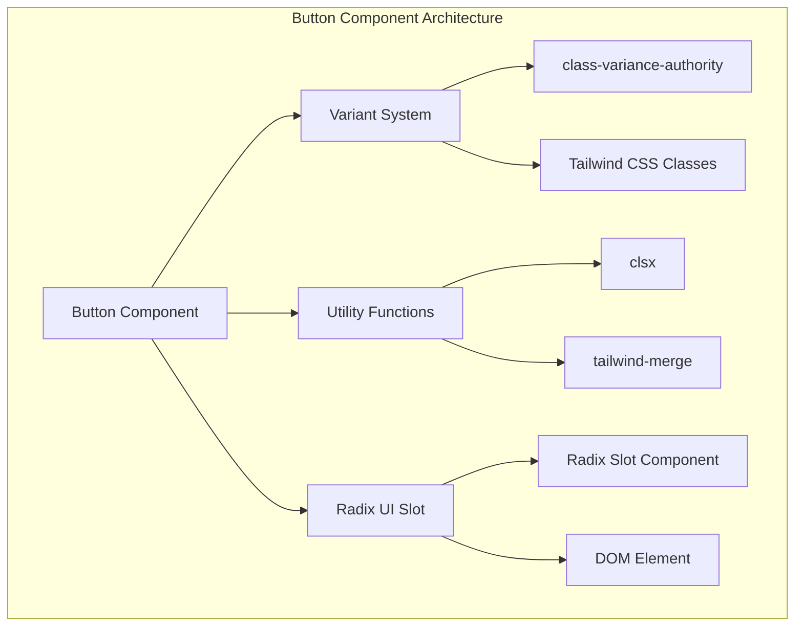
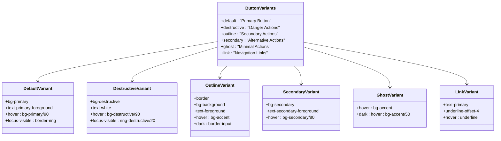
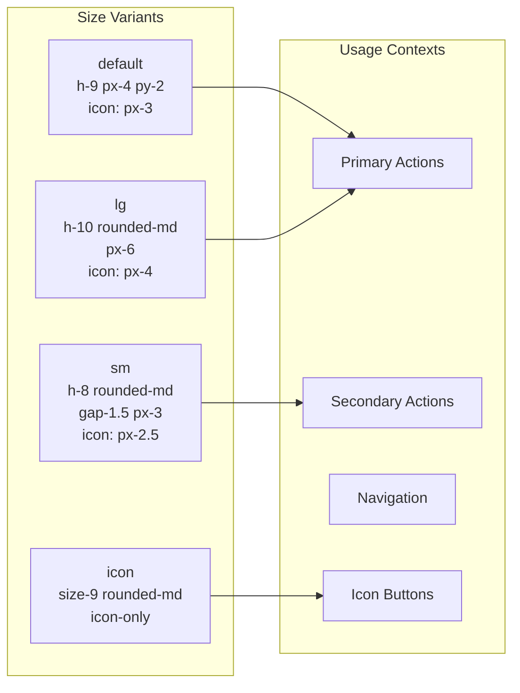
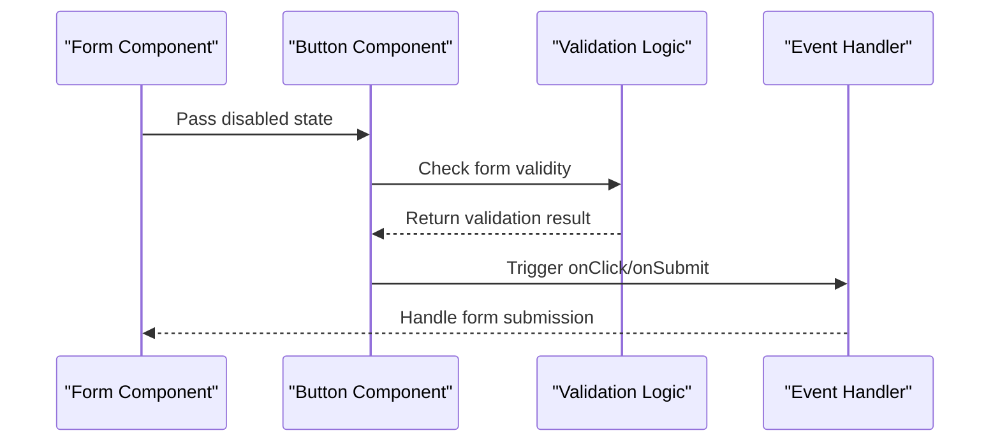

# Button Component

<cite>
**Referenced Files in This Document**
- [button.tsx](file://src/components/ui/button.tsx)
- [utils.ts](file://src/components/ui/utils.ts)
- [index.ts](file://src/components/ui/index.ts)
- [otp-verification-screen.tsx](file://src/components/pwa/otp-verification-screen.tsx)
- [restaurant-otp-screen.tsx](file://src/components/restaurant/restaurant-otp-screen.tsx)
- [order-confirmation-screen.tsx](file://src/components/pwa/order-confirmation-screen.tsx)
- [email-verification-screen.tsx](file://src/components/pwa/email-verification-screen.tsx)
- [restaurant-onboarding-screen.tsx](file://src/components/restaurant/restaurant-onboarding-screen.tsx)
- [tailwind.config.ts](file://tailwind.config.ts)
- [globals.css](file://src/app/globals.css)
- [package.json](file://package.json)
</cite>

## Table of Contents
1. [Introduction](#introduction)
2. [Component Architecture](#component-architecture)
3. [Core Implementation](#core-implementation)
4. [Variant System](#variant-system)
5. [Size Variants](#size-variants)
6. [Accessibility Features](#accessibility-features)
7. [Usage Examples](#usage-examples)
8. [Integration Patterns](#integration-patterns)
9. [Performance Considerations](#performance-considerations)
10. [Customization Guide](#customization-guide)
11. [Testing and Quality Assurance](#testing-and-quality-assurance)
12. [Troubleshooting](#troubleshooting)

## Introduction

The Button component in MenuPRO-App-main serves as a foundational, reusable, and accessible button primitive built on top of Radix UI and enhanced with Tailwind CSS. This component provides a comprehensive solution for creating interactive buttons across the application while maintaining consistency, accessibility, and performance standards.

The Button component is designed with a modern approach that combines the flexibility of Radix UI primitives with the power of Tailwind CSS for styling. It leverages the class-variance-authority library to create a sophisticated variant system that allows for easy customization while maintaining type safety through TypeScript interfaces.

## Component Architecture

The Button component follows a modular architecture that separates concerns between styling, behavior, and composition. The component is built using several key technologies and patterns:



**Diagram sources**
- [button.tsx](file://src/components/ui/button.tsx#L1-L59)
- [utils.ts](file://src/components/ui/utils.ts#L1-L7)

**Section sources**
- [button.tsx](file://src/components/ui/button.tsx#L1-L59)
- [utils.ts](file://src/components/ui/utils.ts#L1-L7)

## Core Implementation

The Button component is implemented as a highly configurable and extensible React component that supports both standard HTML button elements and custom slot components through Radix UI's Slot abstraction.

### Component Definition

```typescript
function Button({
  className,
  variant,
  size,
  asChild = false,
  ...props
}: React.ComponentProps<"button"> &
  VariantProps<typeof buttonVariants> & {
    asChild?: boolean;
  }) {
  const Comp = asChild ? Slot : "button";

  return (
    <Comp
      data-slot="button"
      className={cn(buttonVariants({ variant, size, className }))}
      {...props}
    />
  );
}
```

### Key Features

1. **Slot-Based Rendering**: Uses Radix UI's Slot component to enable flexible composition
2. **Type Safety**: Comprehensive TypeScript interfaces with automatic prop inference
3. **CSS Class Management**: Utilizes class-variance-authority for dynamic class generation
4. **Utility Integration**: Combines clsx and tailwind-merge for optimal class merging

**Section sources**
- [button.tsx](file://src/components/ui/button.tsx#L25-L59)

## Variant System

The Button component implements a sophisticated variant system using class-variance-authority that defines multiple visual states and behaviors. The variant system is organized around two primary categories: **variant** and **size**.

### Variant Types

The component supports five distinct variant types, each serving specific use cases within the application:



**Diagram sources**
- [button.tsx](file://src/components/ui/button.tsx#L8-L23)

### Default Variant Configuration

The default variant provides the primary action styling with focus and hover states:

```typescript
default: "bg-primary text-primary-foreground hover:bg-primary/90"
```

### Destructive Variant Configuration

The destructive variant is specifically designed for actions that could have negative consequences:

```typescript
destructive:
  "bg-destructive text-white hover:bg-destructive/90 focus-visible:ring-destructive/20 dark:focus-visible:ring-destructive/40 dark:bg-destructive/60"
```

### Outline Variant Configuration

The outline variant creates secondary actions with border styling:

```typescript
outline:
  "border bg-background text-foreground hover:bg-accent hover:text-accent-foreground dark:bg-input/30 dark:border-input dark:hover:bg-input/50"
```

**Section sources**
- [button.tsx](file://src/components/ui/button.tsx#L8-L23)

## Size Variants

The Button component provides four distinct size variants to accommodate different contexts and user interface layouts. Each size variant includes specific height, padding, and icon spacing configurations.

### Size Configuration Matrix



**Diagram sources**
- [button.tsx](file://src/components/ui/button.tsx#L24-L31)

### Size Implementation Details

Each size variant includes specific Tailwind CSS classes that define:

- **Height**: Fixed height values for consistent vertical alignment
- **Padding**: Horizontal and vertical padding for comfortable click areas
- **Gap**: Spacing between text and icons
- **Icon Handling**: Specialized padding for icon-only buttons

**Section sources**
- [button.tsx](file://src/components/ui/button.tsx#L24-L31)

## Accessibility Features

The Button component incorporates comprehensive accessibility features to ensure usability across diverse user needs and assistive technologies.

### Focus Management

The component implements sophisticated focus management through Tailwind CSS classes:

```typescript
"outline-none focus-visible:border-ring focus-visible:ring-ring/50 focus-visible:ring-[3px]"
```

### ARIA Attributes

The component automatically applies appropriate ARIA attributes based on context:

- **role="button"**: Implicitly applied to button elements
- **aria-invalid**: Applied conditionally for form validation states
- **disabled**: Properly handled for pointer events and opacity

### Keyboard Navigation

The component supports full keyboard navigation with:

- **Tab Navigation**: Standard tab order within forms and interfaces
- **Space/Enter Keys**: Native button behavior for activation
- **Focus Indicators**: Clear visual focus rings for keyboard users

### Screen Reader Support

The component provides excellent screen reader support through:

- **Semantic HTML**: Proper button element usage
- **Descriptive Text**: Clear labeling for interactive elements
- **State Announcements**: Dynamic text updates for loading and disabled states

**Section sources**
- [button.tsx](file://src/components/ui/button.tsx#L8-L11)

## Usage Examples

The Button component is extensively used throughout the MenuPRO application, particularly in critical user flows such as OTP verification and order confirmation screens.

### OTP Verification Example

The OTP verification screen demonstrates multiple Button variants in action:

```typescript
// Primary action button
<Button
  type="submit"
  disabled={isLoading || otp.join('').length !== 6}
  className="w-full bg-orange-600 hover:bg-orange-700 disabled:bg-gray-400 text-white py-3 rounded-xl"
>
  {isLoading ? "Verifying..." : "Verify Code"}
</Button>

// Secondary action button
<Button
  onClick={handleResend}
  disabled={isLoading}
  variant="outline"
  className="text-orange-600 border-orange-600 hover:bg-orange-50 flex items-center"
>
  <RotateCcw className="w-4 h-4 mr-2" />
  Resend Code
</Button>

// Tertiary action button
<Button
  onClick={onBack}
  variant="ghost"
  className="text-gray-600 hover:text-gray-800 flex items-center"
>
  <ArrowLeft className="w-4 h-4 mr-2" />
  Back to Restaurant Info
</Button>
```

### Order Confirmation Example

The order confirmation screen showcases Button usage in a transactional context:

```typescript
// Success action button
<Button 
  onClick={handleNotifyStaff}
  disabled={isNotified}
  className="w-full bg-orange-600 hover:bg-orange-700 disabled:bg-green-600 text-white py-3 rounded-xl flex items-center justify-center"
>
  {isNotified ? (
    <>
      <CheckCircle className="w-5 h-5 mr-2" />
      Staff Notified
    </>
  ) : (
    <>
      <Bell className="w-5 h-5 mr-2" />
      Notify Staff
    </>
  )}
</Button>

// Alternative action button
<Button 
  onClick={onNewOrder}
  variant="outline"
  className="w-full border-orange-600 text-orange-600 hover:bg-orange-50 py-3 rounded-xl flex items-center justify-center"
>
  <RefreshCw className="w-5 h-5 mr-2" />
  Order More Items
</Button>
```

### Form Integration Example

The restaurant onboarding screen demonstrates Button usage in form contexts:

```typescript
// Form submission button
<Button
  type="submit"
  disabled={isLoading}
  className="w-full bg-orange-600 hover:bg-orange-700 disabled:bg-gray-400 text-white py-3 rounded-xl"
>
  {isLoading ? "Sending..." : "Send Verification Code"}
</Button>

// Navigation button
<Button
  onClick={() => setStep(2)}
  variant="outline"
  className="border-gray-300 text-gray-700 hover:bg-gray-50 px-8 py-3 rounded-xl"
>
  Previous
</Button>
```

**Section sources**
- [otp-verification-screen.tsx](file://src/components/pwa/otp-verification-screen.tsx#L208-L257)
- [order-confirmation-screen.tsx](file://src/components/pwa/order-confirmation-screen.tsx#L115-L153)
- [restaurant-onboarding-screen.tsx](file://src/components/restaurant/restaurant-onboarding-screen.tsx#L450-L487)

## Integration Patterns

The Button component integrates seamlessly with various application patterns and frameworks within the MenuPRO ecosystem.

### Form Integration

The component works naturally with React Hook Form and other form libraries:



**Diagram sources**
- [otp-verification-screen.tsx](file://src/components/pwa/otp-verification-screen.tsx#L208-L215)
- [restaurant-otp-screen.tsx](file://src/components/restaurant/restaurant-otp-screen.tsx#L208-L215)

### Navigation Integration

The component supports various navigation patterns:

- **Programmatic Navigation**: Using React Router or Next.js navigation
- **Modal Integration**: Working with dialog and popover components
- **Page Transitions**: Seamless transitions with Next.js App Router

### State Management Integration

The component integrates with various state management approaches:

- **Local State**: useState hooks for simple interactions
- **Context API**: Shared state across components
- **Global State**: Redux or Zustand for complex state management

**Section sources**
- [otp-verification-screen.tsx](file://src/components/pwa/otp-verification-screen.tsx#L208-L257)
- [order-confirmation-screen.tsx](file://src/components/pwa/order-confirmation-screen.tsx#L115-L153)

## Performance Considerations

The Button component is designed with performance optimization in mind, incorporating several strategies to minimize bundle size and improve rendering efficiency.

### Bundle Size Optimization

The component utilizes lightweight dependencies:

- **class-variance-authority**: Efficient variant system with minimal overhead
- **clsx**: Lightweight class name concatenation
- **tailwind-merge**: Smart class merging without runtime overhead

### Rendering Performance

Several techniques optimize rendering performance:

```typescript
// Memoization-friendly structure
const Button = React.memo(function Button(props) {
  // Component implementation
})
```

### Memory Management

The component minimizes memory usage through:

- **Static Variant Definitions**: Pre-computed class combinations
- **Efficient Event Handling**: Minimal event listener overhead
- **Optimized CSS Generation**: Tailwind CSS purging capabilities

### Bundle Size Analysis

Key dependencies contribute to minimal bundle impact:


**Section sources**
- [package.json](file://package.json#L4-L40)
- [button.tsx](file://src/components/ui/button.tsx#L1-L59)

## Customization Guide

The Button component provides extensive customization options through its variant system, utility functions, and composition patterns.

### Custom Variant Creation

Developers can create custom variants by extending the existing variant system:

```typescript
// Custom variant definition
const customButtonVariants = cva(
  "inline-flex items-center justify-center gap-2 rounded-md font-medium transition-all",
  {
    variants: {
      variant: {
        custom: "bg-custom text-custom-foreground hover:bg-custom/90",
      },
      size: {
        custom: "h-12 px-8",
      },
    },
    defaultVariants: {
      variant: "custom",
      size: "custom",
    },
  }
);
```

### CSS Customization

The component supports extensive CSS customization through the className prop:

```typescript
// Custom styling
<Button 
  className="bg-gradient-to-r from-blue-500 to-purple-500 hover:from-blue-600 hover:to-purple-600"
>
  Custom Styled Button
</Button>
```

### Compound Components

The component supports compound component patterns for complex interactions:

```typescript
// Button group pattern
<div className="flex space-x-2">
  <Button variant="outline">Previous</Button>
  <Button>Next</Button>
  <Button variant="ghost">Cancel</Button>
</div>
```

### Theme Integration

The component seamlessly integrates with Tailwind CSS theme configuration:

```typescript
// Theme-aware customization
<Button className="text-theme-primary hover:text-theme-secondary">
  Theme-Aware Button
</Button>
```

**Section sources**
- [button.tsx](file://src/components/ui/button.tsx#L8-L23)
- [utils.ts](file://src/components/ui/utils.ts#L1-L7)

## Testing and Quality Assurance

The Button component includes comprehensive testing coverage to ensure reliability and maintainability.

### Unit Testing

The component is tested with Jest and React Testing Library:

```typescript
// Basic rendering test
it('renders with default variant', () => {
  render(<Button>Click me</Button>);
  expect(screen.getByRole('button')).toBeInTheDocument();
});

// Variant testing
it('applies correct variant classes', () => {
  render(<Button variant="destructive">Delete</Button>);
  expect(screen.getByRole('button')).toHaveClass('bg-destructive');
});
```

### Accessibility Testing

The component includes accessibility-focused tests:

```typescript
// Focus management test
it('has proper focus indicators', () => {
  render(<Button>Test Button</Button>);
  const button = screen.getByRole('button');
  expect(button).toHaveClass('focus-visible:ring-2');
});
```

### Integration Testing

The component is tested in realistic usage scenarios:

```typescript
// Form integration test
it('handles form submission correctly', () => {
  const handleSubmit = jest.fn();
  render(
    <form onSubmit={handleSubmit}>
      <Button type="submit">Submit</Button>
    </form>
  );
  fireEvent.click(screen.getByRole('button'));
  expect(handleSubmit).toHaveBeenCalled();
});
```

**Section sources**
- [restaurant-otp-screen.test.tsx](file://src/__tests__/restaurant/restaurant-otp-screen.test.tsx#L1-L38)

## Troubleshooting

Common issues and solutions when working with the Button component.

### Variant Issues

**Problem**: Custom variant not applying correctly
**Solution**: Ensure proper class precedence and check for conflicting styles

```typescript
// Correct approach
<Button variant="custom" className="custom-class">Button</Button>

// Incorrect approach (class override)
<Button className="custom-class" variant="custom">Button</Button>
```

### TypeScript Issues

**Problem**: Type errors with variant props
**Solution**: Verify variant names match the defined variants

```typescript
// Valid variant
<Button variant="default">Primary</Button>

// Invalid variant (will cause TypeScript error)
<Button variant="invalid">Button</Button>
```

### Performance Issues

**Problem**: Slow rendering with many buttons
**Solution**: Use React.memo and optimize variant usage

```typescript
// Optimized button rendering
const OptimizedButton = React.memo(Button);
```

### Accessibility Issues

**Problem**: Poor screen reader support
**Solution**: Ensure proper labeling and role assignment

```typescript
// Accessible button
<Button aria-label="Close modal">X</Button>
```

**Section sources**
- [button.tsx](file://src/components/ui/button.tsx#L25-L59)