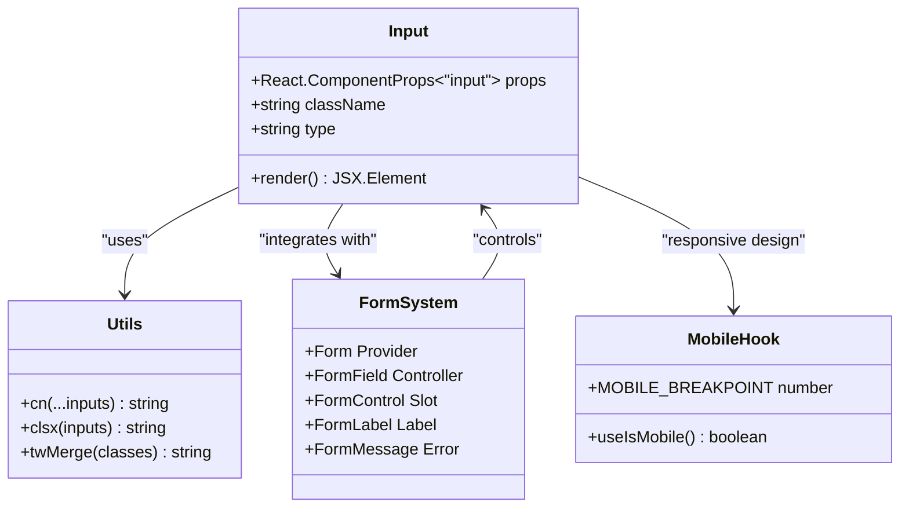
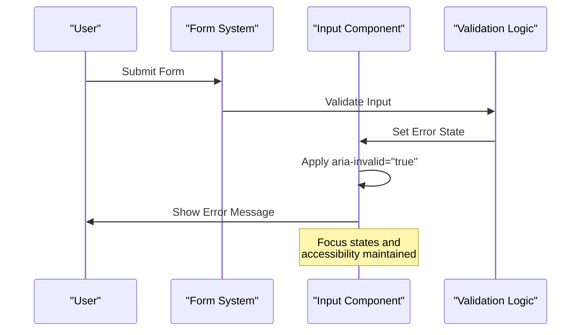

# Input Component Documentation

<cite>
**Referenced Files in This Document**
- [input.tsx](file://src/components/ui/input.tsx)
- [form.tsx](file://src/components/ui/form.tsx)
- [email-verification-screen.tsx](file://src/components/pwa/email-verification-screen.tsx)
- [otp-verification-screen.tsx](file://src/components/pwa/otp-verification-screen.tsx)
- [use-mobile.ts](file://src/components/ui/use-mobile.ts)
- [utils.ts](file://src/components/ui/utils.ts)
- [label.tsx](file://src/components/ui/label.tsx)
- [index.ts](file://src/components/ui/index.ts)
- [textarea.tsx](file://src/components/ui/textarea.tsx)
- [input-otp.tsx](file://src/components/ui/input-otp.tsx)
</cite>

## Table of Contents
1. [Introduction](#introduction)
2. [Component Architecture](#component-architecture)
3. [Core Implementation](#core-implementation)
4. [Props and Configuration](#props-and-configuration)
5. [Integration with Form System](#integration-with-form-system)
6. [Real-World Usage Examples](#real-world-usage-examples)
7. [Accessibility Features](#accessibility-features)
8. [Styling and Customization](#styling-and-customization)
9. [Mobile Responsiveness](#mobile-responsiveness)
10. [Common Issues and Solutions](#common-issues-and-solutions)
11. [Performance Optimization](#performance-optimization)
12. [Best Practices](#best-practices)

## Introduction

The Input component is a fundamental form element in the MenuPRO-App-main application, designed as a controlled form input with comprehensive Tailwind styling and Radix-based accessibility features. Built using React and TypeScript, it serves as the primary interface for user data entry across various screens including email verification and OTP verification processes.

This component exemplifies modern web development practices by combining:
- **Controlled Component Pattern**: Ensures predictable state management
- **Tailwind CSS Integration**: Provides utility-first styling with responsive design
- **Radix UI Accessibility**: Implements WCAG-compliant accessibility standards
- **TypeScript Type Safety**: Offers complete type checking and IntelliSense support

## Component Architecture

The Input component follows a modular architecture that integrates seamlessly with the broader UI system:



**Diagram sources**
- [input.tsx](file://src/components/ui/input.tsx#L1-L22)
- [form.tsx](file://src/components/ui/form.tsx#L1-L169)
- [utils.ts](file://src/components/ui/utils.ts#L1-L7)
- [use-mobile.ts](file://src/components/ui/use-mobile.ts#L1-L22)

**Section sources**
- [input.tsx](file://src/components/ui/input.tsx#L1-L22)
- [utils.ts](file://src/components/ui/utils.ts#L1-L7)

## Core Implementation

The Input component is implemented as a lightweight wrapper around the native HTML input element, enhanced with sophisticated styling and accessibility features:

```typescript
function Input({ className, type, ...props }: React.ComponentProps<"input">) {
  return (
    <input
      type={type}
      data-slot="input"
      className={cn(
        // Base styling classes
        "file:text-foreground placeholder:text-muted-foreground selection:bg-primary selection:text-primary-foreground dark:bg-input/30 border-input flex h-9 w-full min-w-0 rounded-md border px-3 py-1 text-base bg-input-background transition-[color,box-shadow] outline-none file:inline-flex file:h-7 file:border-0 file:bg-transparent file:text-sm file:font-medium disabled:pointer-events-none disabled:cursor-not-allowed disabled:opacity-50 md:text-sm",
        // Focus states
        "focus-visible:border-ring focus-visible:ring-ring/50 focus-visible:ring-[3px]",
        // Error states
        "aria-invalid:ring-destructive/20 dark:aria-invalid:ring-destructive/40 aria-invalid:border-destructive",
        className,
      )}
      {...props}
    />
  );
}
```

### Key Implementation Features:

1. **TypeScript Integration**: Uses `React.ComponentProps<"input">` to inherit all native input attributes
2. **Utility-First Styling**: Leverages Tailwind CSS for atomic class composition
3. **Data Attributes**: Includes `data-slot="input"` for testing and styling identification
4. **Spread Props**: Maintains compatibility with all native input attributes

**Section sources**
- [input.tsx](file://src/components/ui/input.tsx#L1-L22)

## Props and Configuration

The Input component supports all standard HTML input attributes through TypeScript's `React.ComponentProps<"input">` interface:

### Standard Props

| Prop | Type | Description | Example |
|------|------|-------------|---------|
| `type` | `string` | Input type (text, email, password, etc.) | `"email"` |
| `placeholder` | `string` | Placeholder text for empty input | `"Enter your email"` |
| `value` | `string` | Controlled value | `""` |
| `onChange` | `(event: ChangeEvent<HTMLInputElement>) => void` | Value change handler | `(e) => setValue(e.target.value)` |
| `disabled` | `boolean` | Disables the input | `true/false` |
| `className` | `string` | Additional CSS classes | `"custom-class"` |

### Enhanced Props

The component automatically handles:

- **Focus States**: Visual feedback for keyboard navigation
- **Error States**: Dynamic styling based on validation errors
- **Disabled States**: Proper cursor and pointer event handling
- **Mobile Optimization**: Responsive sizing and touch-friendly design

**Section sources**
- [input.tsx](file://src/components/ui/input.tsx#L1-L22)

## Integration with Form System

The Input component works seamlessly with the form system through the `FormControl` component, providing automatic accessibility and validation integration:



**Diagram sources**
- [form.tsx](file://src/components/ui/form.tsx#L80-L95)
- [input.tsx](file://src/components/ui/input.tsx#L10-L11)

### Form Integration Features:

1. **Automatic ARIA Attributes**: `aria-invalid` is set based on validation state
2. **Error Message Association**: Links input to error messages via `aria-describedby`
3. **Focus Management**: Proper focus handling during validation
4. **Accessibility Tree**: Integrates with screen readers and assistive technologies

**Section sources**
- [form.tsx](file://src/components/ui/form.tsx#L80-L95)
- [input.tsx](file://src/components/ui/input.tsx#L10-L11)

## Real-World Usage Examples

### Email Verification Screen

The Input component is extensively used in the email verification process:

```typescript
// Email Input with validation
<Input
  id="email"
  type="email"
  value={email}
  onChange={(e) => setEmail(e.target.value)}
  placeholder="Enter your email address"
  className="pl-10 py-3 rounded-xl border-gray-200 focus:border-orange-500 focus:ring-orange-500"
  disabled={isLoading}
/>
```

### OTP Verification Screen

For OTP entry, the component is configured for numeric input with enhanced UX:

```typescript
// Individual OTP digit inputs
<Input
  key={index}
  ref={(el) => { inputRefs.current[index] = el; }}
  type="text"
  inputMode="numeric"
  pattern="[0-9]"
  maxLength={1}
  value={digit}
  onChange={(e) => handleOtpChange(index, e.target.value)}
  onKeyDown={(e) => handleKeyDown(index, e)}
  onPaste={handlePaste}
  className="w-12 h-12 text-center text-xl font-bold border-2 border-gray-200 focus:border-orange-500 focus:ring-orange-500 rounded-lg"
  disabled={isLoading}
/>
```

### Key Usage Patterns:

1. **Email Input**: Standard email validation with icon prefix
2. **OTP Input**: Numeric-only input with auto-focus and paste support
3. **Disabled States**: Loading indicators and form submission blocking
4. **Custom Styling**: Brand-specific color schemes and rounded corners

**Section sources**
- [email-verification-screen.tsx](file://src/components/pwa/email-verification-screen.tsx#L120-L130)
- [otp-verification-screen.tsx](file://src/components/pwa/otp-verification-screen.tsx#L140-L155)

## Accessibility Features

The Input component implements comprehensive accessibility features following WCAG guidelines:

### Keyboard Navigation

- **Tab Navigation**: Proper tab order and focus management
- **Arrow Keys**: Support for directional navigation in multi-input scenarios
- **Enter/Space**: Activation of associated actions
- **Escape**: Cancellation of input operations

### Screen Reader Support

- **Labels**: Associated with form labels via `htmlFor` attribute
- **Descriptions**: Error messages linked via `aria-describedby`
- **States**: Visual indication of focus, error, and disabled states
- **Roles**: Semantic input roles for assistive technologies

### ARIA Attributes

```typescript
// Automatic ARIA integration
<Slot
  data-slot="form-control"
  id={formItemId}
  aria-describedby={
    !error
      ? `${formDescriptionId}`
      : `${formDescriptionId} ${formMessageId}`
  }
  aria-invalid={!!error}
  {...props}
/>
```

### Focus Management

The component provides enhanced focus states:
- **Focus Ring**: Visible focus indicator with appropriate ring color
- **Focus Within**: Group-level focus styling
- **Keyboard Navigation**: Clear visual feedback for keyboard users

**Section sources**
- [form.tsx](file://src/components/ui/form.tsx#L80-L95)
- [input.tsx](file://src/components/ui/input.tsx#L10-L11)

## Styling and Customization

The Input component uses a sophisticated Tailwind CSS class composition system:

### Base Styling Classes

```typescript
"file:text-foreground placeholder:text-muted-foreground selection:bg-primary selection:text-primary-foreground dark:bg-input/30 border-input flex h-9 w-full min-w-0 rounded-md border px-3 py-1 text-base bg-input-background transition-[color,box-shadow] outline-none file:inline-flex file:h-7 file:border-0 file:bg-transparent file:text-sm file:font-medium disabled:pointer-events-none disabled:cursor-not-allowed disabled:opacity-50 md:text-sm"
```

### State-Based Styling

```typescript
// Focus states
"focus-visible:border-ring focus-visible:ring-ring/50 focus-visible:ring-[3px]"

// Error states
"aria-invalid:ring-destructive/20 dark:aria-invalid:ring-destructive/40 aria-invalid:border-destructive"
```

### Customization Options

1. **Size Variants**: Standard height (h-9) with responsive scaling
2. **Border Radius**: Consistent rounded-md styling
3. **Padding**: Uniform px-3 py-1 for optimal spacing
4. **Color Schemes**: Dark mode support with opacity modifiers
5. **Transition Effects**: Smooth color and shadow transitions

### Brand Integration

The component supports brand-specific customizations:
- **Border Colors**: Orange focus states for MenuPRO branding
- **Background Opacity**: Semi-transparent backgrounds for depth
- **Selection Colors**: Primary color scheme for text selection

**Section sources**
- [input.tsx](file://src/components/ui/input.tsx#L8-L15)

## Mobile Responsiveness

The Input component adapts to mobile devices through the `useIsMobile` hook and responsive design principles:

### Mobile Detection

```typescript
const MOBILE_BREAKPOINT = 768;

export function useIsMobile() {
  const [isMobile, setIsMobile] = React.useState<boolean | undefined>(undefined);
  
  React.useEffect(() => {
    const mql = window.matchMedia(`(max-width: ${MOBILE_BREAKPOINT - 1}px)`);
    const onChange = () => {
      setIsMobile(window.innerWidth < MOBILE_BREAKPOINT);
    };
    mql.addEventListener("change", onChange);
    setIsMobile(window.innerWidth < MOBILE_BREAKPOINT);
    return () => mql.removeEventListener("change", onChange);
  }, []);
  
  return !!isMobile;
}
```

### Responsive Features

1. **Touch-Friendly**: Larger tap targets and spacing
2. **Input Modes**: Automatic keyboard optimization (`inputMode`)
3. **Viewport Adaptation**: Proper scaling and sizing
4. **Gesture Support**: Swipe and pinch-to-zoom compatibility

### Mobile-Specific Styling

The component includes mobile-optimized classes:
- **Text Scaling**: `md:text-sm` for medium screens and above
- **Height Adjustments**: Consistent input heights across devices
- **Spacing**: Adequate padding for touch interaction

**Section sources**
- [use-mobile.ts](file://src/components/ui/use-mobile.ts#L1-L22)

## Common Issues and Solutions

### Uncontrolled to Controlled Input Warning

**Problem**: React warning about changing from uncontrolled to controlled input.

**Solution**:
```typescript
// ❌ Incorrect - mixing controlled/uncontrolled
const [value, setValue] = useState("");
<input value={value} /> // No onChange handler

// ✅ Correct - consistent controlled behavior
const [value, setValue] = useState("");
<input 
  value={value} 
  onChange={(e) => setValue(e.target.value)} 
/>
```

### Focus State Conflicts

**Problem**: Custom focus styles conflicting with component styling.

**Solution**:
```typescript
// Use data-slot for targeted styling
<div className="group">
  <Input className="group-focus-within:border-orange-500" />
</div>
```

### Error State Persistence

**Problem**: Error states not clearing after successful validation.

**Solution**:
```typescript
// Clear error state on successful validation
const validateAndSubmit = () => {
  if (isValid) {
    setError(""); // Clear error message
    // Proceed with form submission
  }
};
```

### Performance Issues

**Problem**: Excessive re-renders causing performance degradation.

**Solution**:
```typescript
// Memoize expensive computations
const memoizedValidation = useMemo(() => {
  return validateEmail(value);
}, [value]);
```

## Performance Optimization

### Debouncing Input Events

For real-time validation scenarios:

```typescript
import { useCallback, useRef } from "react";

const useDebouncedCallback = (callback: Function, delay: number) => {
  const timeoutRef = useRef<NodeJS.Timeout>();
  
  return useCallback((...args: any[]) => {
    if (timeoutRef.current) {
      clearTimeout(timeoutRef.current);
    }
    timeoutRef.current = setTimeout(() => callback(...args), delay);
  }, [callback, delay]);
};
```

### Optimizing Re-renders

```typescript
// Use React.memo for parent components
const OptimizedInputWrapper = React.memo(({ value, onChange }) => (
  <Input value={value} onChange={onChange} />
));

// Use shallow equality checks
const shouldComponentUpdate = (prevProps, nextProps) => {
  return prevProps.value !== nextProps.value;
};
```

### Memory Management

```typescript
// Clean up event listeners
useEffect(() => {
  const handleResize = () => updateMobileState();
  window.addEventListener('resize', handleResize);
  
  return () => {
    window.removeEventListener('resize', handleResize);
  };
}, []);
```

## Best Practices

### Component Usage Guidelines

1. **Always Use with Form System**: Leverage the integrated form validation
2. **Provide Descriptive Labels**: Associate inputs with meaningful labels
3. **Handle Disabled States**: Show appropriate visual feedback
4. **Implement Validation**: Use built-in error state support
5. **Consider Mobile Users**: Test on various screen sizes

### Code Organization

```typescript
// Good: Structured component with clear responsibilities
export function EmailInput({ value, onChange, error, disabled }) {
  return (
    <div className="space-y-2">
      <Label htmlFor="email">Email Address</Label>
      <Input
        id="email"
        type="email"
        value={value}
        onChange={onChange}
        placeholder="your@email.com"
        aria-invalid={!!error}
        disabled={disabled}
      />
      {error && <FormMessage>{error}</FormMessage>}
    </div>
  );
}
```

### Testing Strategies

1. **Unit Tests**: Test component rendering and prop handling
2. **Integration Tests**: Verify form integration and validation
3. **Accessibility Tests**: Ensure WCAG compliance
4. **Mobile Tests**: Validate responsive behavior

### Maintenance Tips

1. **Keep Dependencies Minimal**: Only import necessary utilities
2. **Document Custom Props**: Add JSDoc comments for complex configurations
3. **Monitor Performance**: Track render performance metrics
4. **Update Regularly**: Keep Tailwind and Radix UI dependencies current

**Section sources**
- [input.tsx](file://src/components/ui/input.tsx#L1-L22)
- [form.tsx](file://src/components/ui/form.tsx#L1-L169)