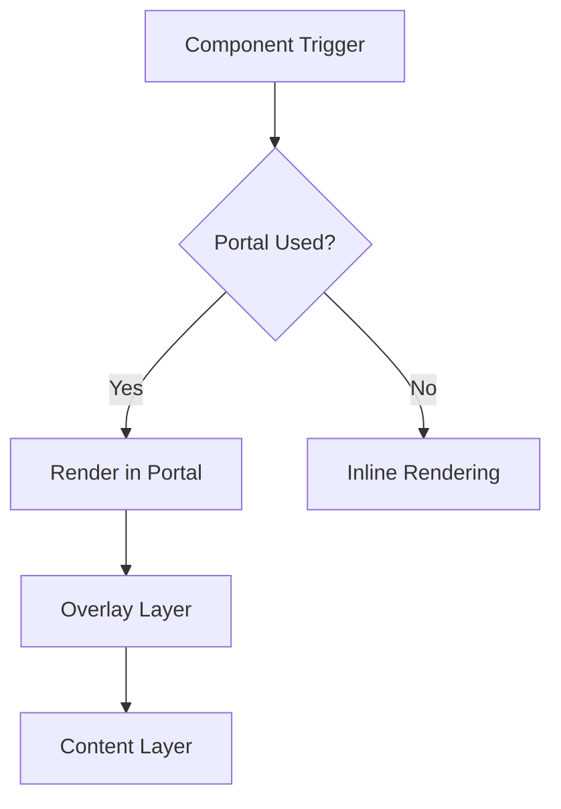
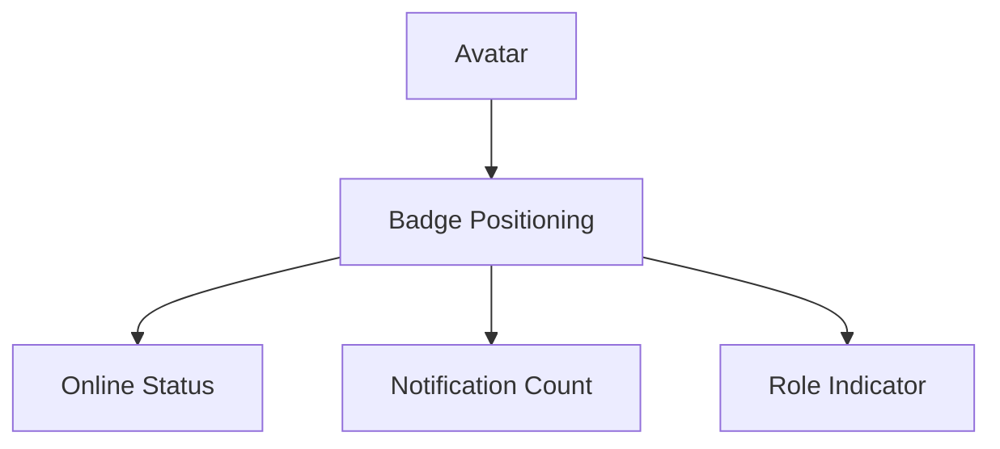
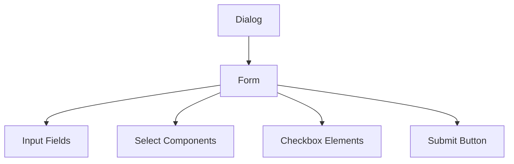
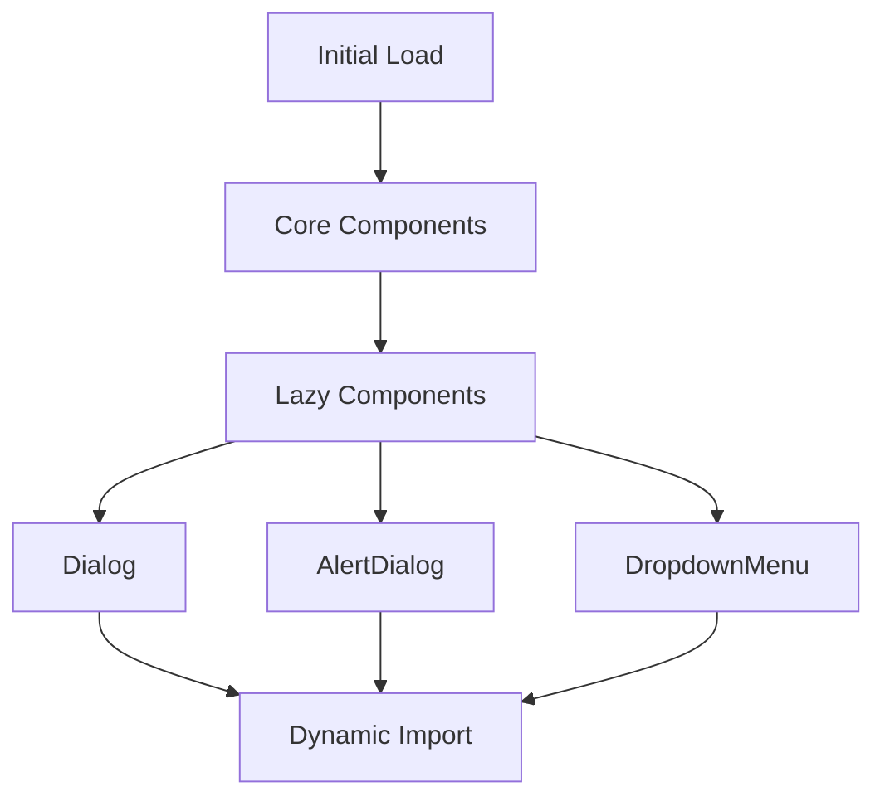
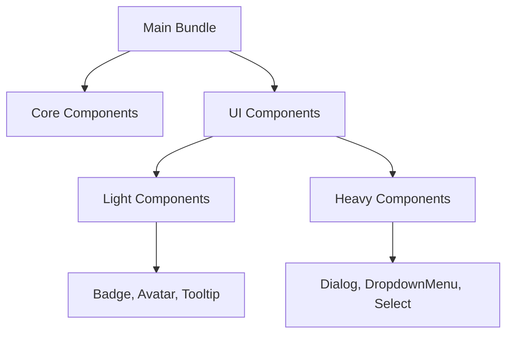

# Other UI Components

<cite>
**Referenced Files in This Document**   
- [accordion.tsx](file://src/components/ui/accordion.tsx)
- [alert-dialog.tsx](file://src/components/ui/alert-dialog.tsx)
- [alert.tsx](file://src/components/ui/alert.tsx)
- [avatar.tsx](file://src/components/ui/avatar.tsx)
- [badge.tsx](file://src/components/ui/badge.tsx)
- [checkbox.tsx](file://src/components/ui/checkbox.tsx)
- [dialog.tsx](file://src/components/ui/dialog.tsx)
- [dropdown-menu.tsx](file://src/components/ui/dropdown-menu.tsx)
- [select.tsx](file://src/components/ui/select.tsx)
- [tabs.tsx](file://src/components/ui/tabs.tsx)
- [tooltip.tsx](file://src/components/ui/tooltip.tsx)
- [utils.ts](file://src/components/ui/utils.ts)
- [restaurant-dashboard.tsx](file://src/components/restaurant/restaurant-dashboard.tsx)
- [menu-upload-screen.tsx](file://src/components/restaurant/menu-upload-screen.tsx)
</cite>

## Table of Contents
1. [Introduction](#introduction)
2. [Shared Patterns and Architecture](#shared-patterns-and-architecture)
3. [Component Reference](#component-reference)
   - [Accordion](#accordion)
   - [AlertDialog](#alertdialog)
   - [Alert](#alert)
   - [Avatar](#avatar)
   - [Badge](#badge)
   - [Checkbox](#checkbox)
   - [Dialog](#dialog)
   - [DropdownMenu](#dropdownmenu)
   - [Select](#select)
   - [Tabs](#tabs)
   - [Tooltip](#tooltip)
4. [Cross-Component Composition](#cross-component-composition)
5. [Performance and Bundle Optimization](#performance-and-bundle-optimization)
6. [Integration with Design System](#integration-with-design-system)

## Introduction
This document provides a comprehensive overview of the additional UI components in the MenuPRO-App-main component library. These components are built on top of Radix UI primitives and styled using Tailwind CSS, forming a cohesive design system that ensures consistency across the application. The components are designed to be accessible, composable, and theme-aware, enabling consistent user experiences across both customer-facing and restaurant-admin interfaces.

## Shared Patterns and Architecture

The UI components follow a consistent architectural pattern based on Radix UI primitives, ensuring accessibility and proper state management. All components are implemented as client components using the `"use client"` directive, enabling interactivity in the Next.js application.

### Portal Rendering
Components like AlertDialog, Dialog, DropdownMenu, Select, and Tooltip use portal rendering to ensure proper layering and positioning in the DOM. This pattern allows these components to render outside their parent component tree, preventing clipping issues and ensuring they appear above other content.



**Diagram sources**
- [dialog.tsx](file://src/components/ui/dialog.tsx#L30-L40)
- [dropdown-menu.tsx](file://src/components/ui/dropdown-menu.tsx#L50-L60)

### Controlled vs Uncontrolled State
All interactive components support both controlled and uncontrolled state patterns. Components like Accordion, Tabs, and Select expose state management through Radix UI's built-in state handling, allowing developers to choose the appropriate pattern based on their use case.

### Accessibility Compliance
All components are built with accessibility as a core principle, leveraging Radix UI's accessible primitives. Key accessibility features include:
- Proper ARIA roles and attributes
- Keyboard navigation support
- Focus management
- Screen reader compatibility
- High contrast modes

**Section sources**
- [utils.ts](file://src/components/ui/utils.ts#L1-L7)
- [dropdown-menu.tsx](file://src/components/ui/dropdown-menu.tsx#L1-L10)

## Component Reference

### Accordion
The Accordion component provides a vertically stacked set of headers that reveal or hide associated content panels. It's commonly used for FAQ sections or to organize content in a space-efficient manner.

**Key Props:**
- `type`: Determines the state behavior ("single" or "multiple")
- `defaultValue`: Initial active item(s)
- `value`: Controlled active item(s)
- `onValueChange`: Callback when active item changes

**Usage Context:**
Ideal for content sections where users need to access information selectively, such as restaurant details or menu categories.

**Section sources**
- [accordion.tsx](file://src/components/ui/accordion.tsx#L1-L67)

### AlertDialog
The AlertDialog component displays a modal dialog that requires user confirmation, typically for destructive actions or important decisions.

**Key Props:**
- `open`: Controlled open state
- `onOpenChange`: Callback when dialog state changes
- `defaultOpen`: Initial open state

**Subcomponents:**
- AlertDialogTrigger: Opens the dialog
- AlertDialogContent: Dialog container
- AlertDialogHeader/Footer: Structured layout sections
- AlertDialogTitle/Description: Content elements
- AlertDialogAction: Primary action button
- AlertDialogCancel: Secondary/cancel button

**Usage Context:**
Used for confirmation actions such as deleting menu items, removing restaurant locations, or confirming order changes.

**Section sources**
- [alert-dialog.tsx](file://src/components/ui/alert-dialog.tsx#L1-L158)

### Alert
The Alert component displays important messages to users with visual prominence. It supports different variants for various message types.

**Key Props:**
- `variant`: "default" or "destructive" for error messages
- `className`: Additional Tailwind classes

**Subcomponents:**
- AlertTitle: Bold heading for the alert
- AlertDescription: Detailed message content

**Usage Context:**
Displaying form validation errors, system status messages, or important notifications in both customer and restaurant interfaces.

**Section sources**
- [alert.tsx](file://src/components/ui/alert.tsx#L1-L67)

### Avatar
The Avatar component displays user profile images with fallback text when images are unavailable.

**Key Props:**
- No specific props beyond standard HTML attributes
- Uses composition with AvatarImage and AvatarFallback

**Subcomponents:**
- AvatarImage: Displays the profile image
- AvatarFallback: Text fallback when image fails to load

**Usage Context:**
User profile displays in restaurant dashboards, customer accounts, and team management interfaces.

**Section sources**
- [avatar.tsx](file://src/components/ui/avatar.tsx#L1-L54)

### Badge
The Badge component displays small status indicators or labels with different visual styles.

**Key Props:**
- `variant`: "default", "secondary", "destructive", or "outline"
- `asChild`: When true, renders as a slot for other components
- `className`: Additional styling classes

**Usage Context:**
Status indicators (e.g., "New", "Updated"), category labels, or notification counters.

**Section sources**
- [badge.tsx](file://src/components/ui/badge.tsx#L1-L47)

### Checkbox
The Checkbox component provides a controlled checkbox input with consistent styling.

**Key Props:**
- Inherits standard checkbox props (checked, onCheckedChange, disabled)
- Visual styling is theme-aware and accessible

**Usage Context:**
Form inputs, feature toggles, and selection interfaces in restaurant settings and customer preferences.

**Section sources**
- [checkbox.tsx](file://src/components/ui/checkbox.tsx#L1-L33)

### Dialog
The Dialog component displays a modal dialog for complex interactions that require user attention.

**Key Props:**
- `open`: Controlled open state
- `onOpenChange`: State change callback
- `defaultOpen`: Initial state

**Subcomponents:**
- DialogTrigger: Opens the dialog
- DialogContent: Main dialog container
- DialogHeader/Footer: Layout sections
- DialogTitle/Description: Content elements
- DialogClose: Close button

**Usage Context:**
Complex forms, detailed views, and multi-step processes in the restaurant administration interface.

**Section sources**
- [dialog.tsx](file://src/components/ui/dialog.tsx#L1-L136)

### DropdownMenu
The DropdownMenu component provides a context menu that appears when users interact with a trigger element.

**Key Props:**
- `sideOffset`: Distance from the trigger element
- Various subcomponents for different menu item types

**Subcomponents:**
- DropdownMenuTrigger: Element that opens the menu
- DropdownMenuContent: Menu container
- DropdownMenuItem: Standard menu item
- DropdownMenuCheckboxItem: Checkable menu item
- DropdownMenuRadioItem: Radio selection item
- DropdownMenuSeparator: Visual divider
- DropdownMenuShortcut: Keyboard shortcut labels

**Usage Context:**
Navigation menus in the restaurant-dashboard, context menus for menu items, and action menus for order management.

**Section sources**
- [dropdown-menu.tsx](file://src/components/ui/dropdown-menu.tsx#L1-L258)

### Select
The Select component provides a dropdown selection interface with enhanced styling and accessibility.

**Key Props:**
- `size`: "sm" or "default" for different heights
- `value`: Selected value
- `onValueChange`: Callback when selection changes

**Subcomponents:**
- SelectTrigger: Display element
- SelectContent: Dropdown container
- SelectItem: Individual selectable items
- SelectGroup/Label: Organizational elements
- SelectScrollUp/DownButton: Navigation controls

**Usage Context:**
Form inputs requiring selection from multiple options, such as category selection or filter controls.

**Section sources**
- [select.tsx](file://src/components/ui/select.tsx#L1-L190)

### Tabs
The Tabs component allows users to switch between different views or data sets.

**Key Props:**
- `value`: Active tab
- `onValueChange`: Callback when tab changes
- `defaultValue`: Initial active tab

**Subcomponents:**
- TabsList: Container for tab triggers
- TabsTrigger: Individual tab buttons
- TabsContent: Content panels for each tab

**Usage Context:**
Interface organization in the menu-upload-screen for switching between file types, settings pages, or data views.

**Section sources**
- [tabs.tsx](file://src/components/ui/tabs.tsx#L1-L67)

### Tooltip
The Tooltip component displays additional information when users hover over or focus on an element.

**Key Props:**
- `sideOffset`: Distance from the target element
- `delayDuration`: Time before tooltip appears

**Subcomponents:**
- TooltipTrigger: Element that activates the tooltip
- TooltipContent: Tooltip message container
- TooltipProvider: Context provider for global settings

**Usage Context:**
Explaining icons with limited visual affordance, providing additional context for form fields, or showing truncated text.

**Section sources**
- [tooltip.tsx](file://src/components/ui/tooltip.tsx#L1-L62)

## Cross-Component Composition

The component library supports rich composition patterns that enable complex UIs while maintaining consistency.

### Badge with Avatar
Badges can be composed with Avatars to indicate user status:



This pattern is used in team management interfaces to show staff availability or in customer views to indicate order status.

### Dialog with Form Components
Dialogs frequently contain forms with various input components:



This composition is common in restaurant onboarding flows and menu editing interfaces.

**Section sources**
- [restaurant-dashboard.tsx](file://src/components/restaurant/restaurant-dashboard.tsx#L1-L50)
- [menu-upload-screen.tsx](file://src/components/restaurant/menu-upload-screen.tsx#L1-L50)

## Performance and Bundle Optimization

### Lazy Loading
Heavy components like Dialog and AlertDialog are candidates for lazy loading to improve initial page load performance:



This approach reduces the initial JavaScript bundle size by loading complex components only when needed.

### Bundle Splitting
The component library structure enables effective code splitting:



Components are automatically split by the build system based on usage patterns and import relationships.

**Section sources**
- [index.ts](file://src/components/ui/index.ts#L1-L6)

## Integration with Design System

### Tailwind Styling
All components leverage Tailwind CSS for styling, using the `cn` utility function for class composition:

```typescript
function cn(...inputs: ClassValue[]) {
  return twMerge(clsx(inputs));
}
```

This utility combines `clsx` for conditional class rendering with `tailwind-merge` for conflict resolution, ensuring consistent styling.

### Theme Integration
Components are designed to work with the application's theme system through CSS variables and semantic class names:

- Color variants use semantic names (primary, secondary, destructive)
- Spacing and sizing follow the design system's scale
- Typography adheres to the defined font hierarchy

The components automatically adapt to both light and dark modes through conditional classes and CSS variables.

**Section sources**
- [utils.ts](file://src/components/ui/utils.ts#L1-L7)